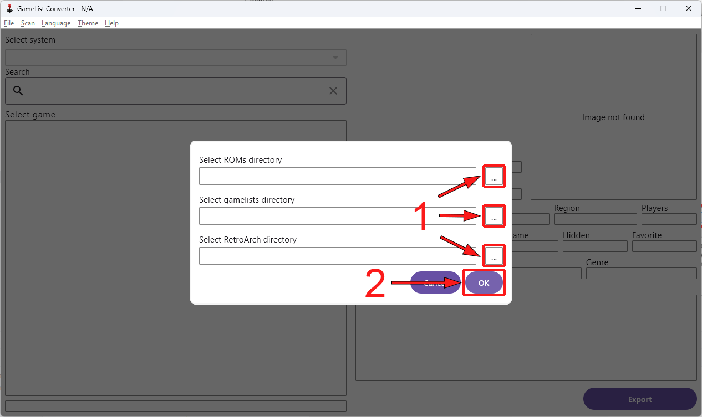
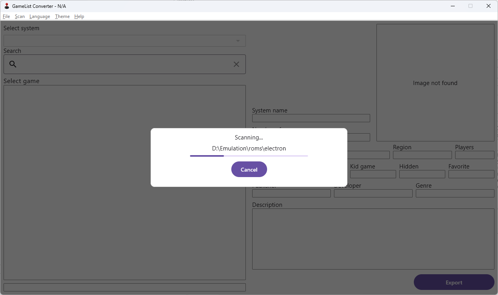
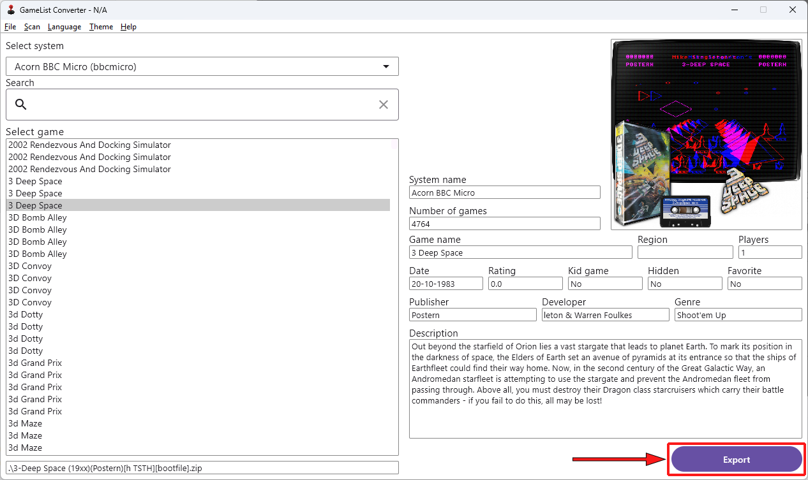
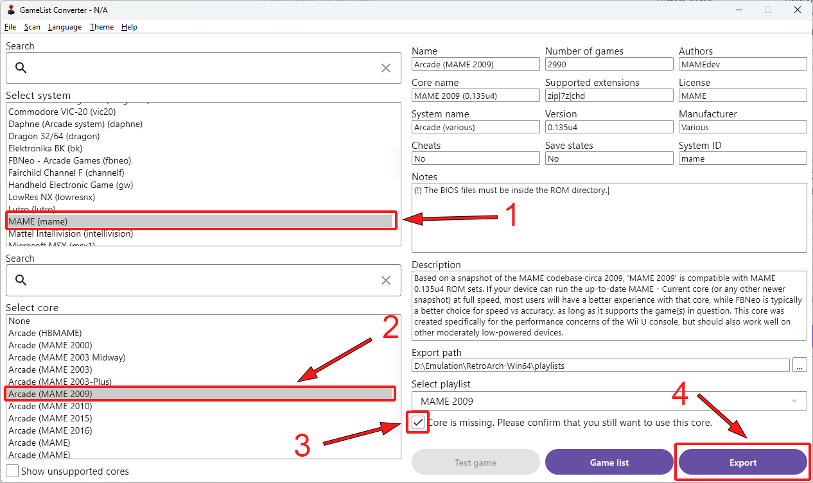
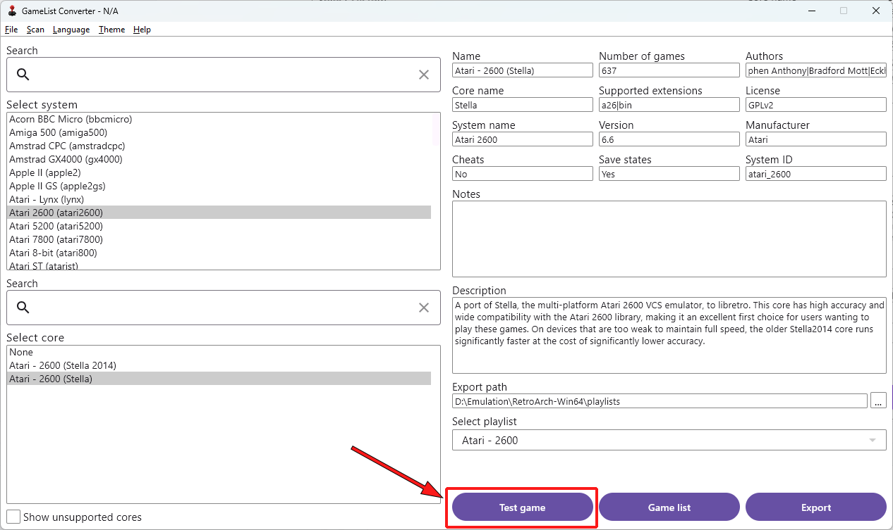
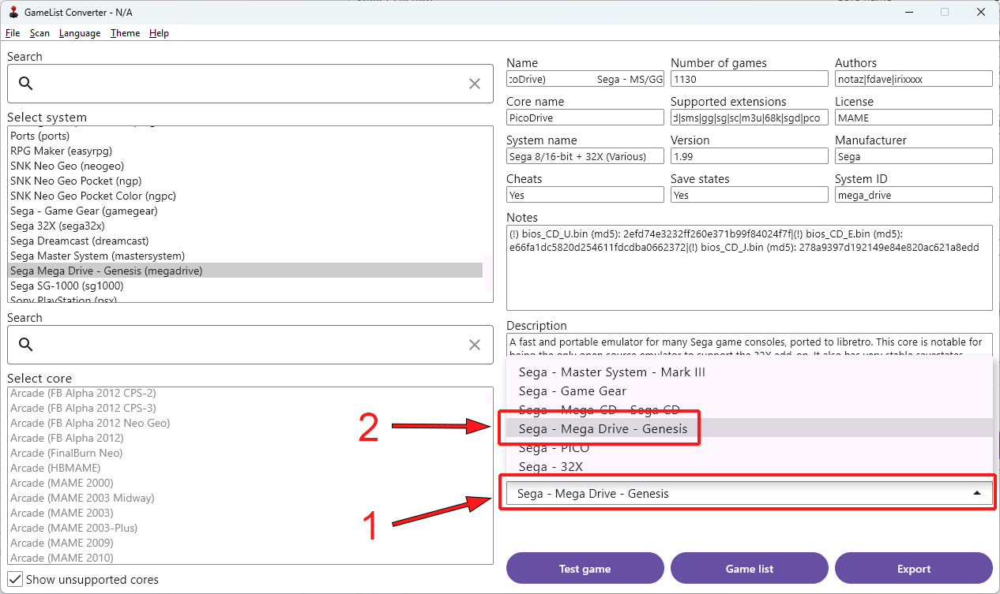
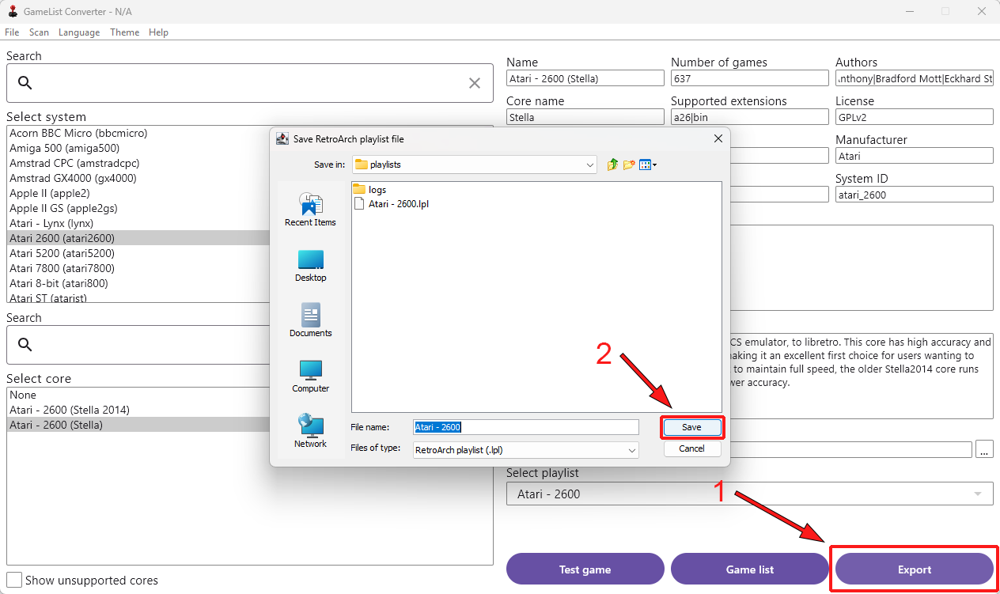
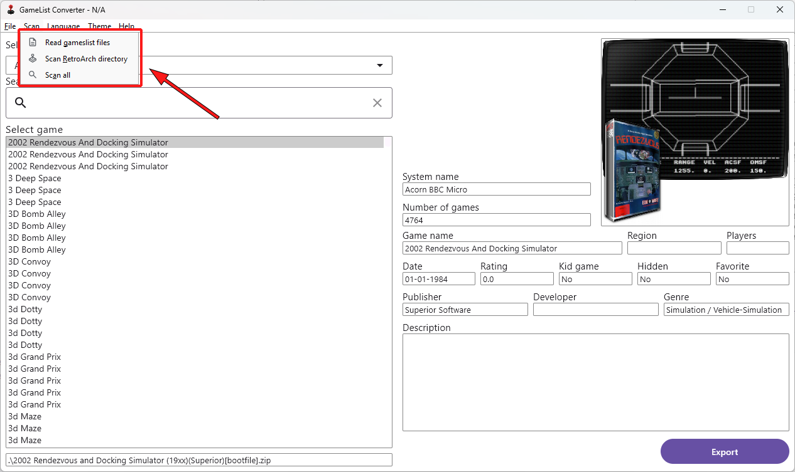

= GameList Converter User Manual
:doctype: book
:toc: left
:toclevels: 2

== Overview
GameList converter is application that converts a `gamelist.xml` file to the RetroArch playlist format. As you can probably see, it is highly inspired by GameList Editor. This project is not intended to replace it. This application cannot edit, scrape or manage your `gamelist.xml` in any way. It is only used to convert it to the RetroArch playlist. For best results, your `gamelist.xml` should have been created using Screen Scrapper.

=== Prerequisites
- Correctly structured ROM directory used for your RecalBox or Retropie
- `gamelist.xml` *must be* in your systems root directory. For example `roms/atari2600/gamelist.xml`, `roms/fbneo/gamelist.xml`, `roms/nes/gamelist.xml`... etc.
- RetroArch installed (https://www.retroarch.com)

=== What this program can do?
It will

- Read your `gamelist.xml` files, as long as you provide ROMs directory.
- It will convert your `gamelist.xml` file to the RetroArch playlist file (.lpl)

=== What this program cannot do?
It will not

- Edit/Delete/Create your `gamelist.xml` file. We already have super awesome GameList Editor for that. Link: https://github.com/andresdelcampo/GameList_Editor
- Edit existing RetroArch playlist file
- Download or scrap games for you
- Download RetroArch cores for you

== Using GameList converter
We will go through some basic usage of the GameList converter.

=== Select directories
Before you can convert your playlists, you must select ROMs and RetroArch directory.

=== Select ROM's directory
Your first step would be to select ROMs directory. Please note, you must set root of your roms directory (for example `E:\Emulation\roms`), and not the system specific roms directory (for example `E:\Emulation\roms\atari2600`).

Then, wait for all system's to load. Depending on how many systems you have, it can take time. After everything is loaded, you should see dropdown list of the systems, and list of the games for every system.

*Note*: Hidden games will show in different color.

*No games?*: If you don't see any systems and games, please make sure you have selected correct directory that contains subdirectory of your systems. Something similar to what is shown in the image above.

If it still does not work, please raise the issue in our GitHub.

=== Select RetroArch directory
Second step would be to select RetroArch directory. Even though this is not mandatory, it is highly recommended since it will help you select appropriate list name, and core for your playlist. Please select root directory of your RetroArch, and not the Playlist directory.

After this is done, you can click on button to continue to the export screen.

=== Select system and core
Before you can convert your `gamelist.xml`, you must select system you want to export, and core for it. In the example bellow, we have selected MAME system and Arcade (MAME) core. Core will be automatically selected when you select the system, but you should still double check that correct one is selected for you.

*Note*: In case you don't have core installed in your RetroArch, you will have to confirm that you still want to use it. Just make sure you install it afterwards using RetroArch UI.

RetroArch playlist path will be selected for you, but you can change it in case you want to save playlists to another place.

Only thing that is left is to click on the export button and save the playlist.

=== Testing selected system and core
Before you save playlist, you can test if combination of selected core and system will work. You can use `Test game` button. Please note that you will be unable to choose which game is to be tested. Random game from the list will be selected. So, if one game does not work, try again. Maybe it's just a ROM issue. If test fails, you will see the message in the UI letting you know execution failed. RetroArch directory must be selected in order for this functionality to work.

Q: Why can't I pick which game to test?

A: Because I would have to bring whole game list in this UI, which will take a lots of space unnecessarily. If advanced tests are needed, then it can be done through RetroArch directly.

Q: Test button is disabled

A: Either you haven't selected RetroArch director, core is missing in RetroArch, System is not supported in RetroArch or game list is empty.

=== Showing all cores
In case you want to see the list of all cores, you can select the option to show the all cores.
This will display all the cores, but will gray out the ones that are not supported for the current system. You can still use them to create your playlist, but it is not recommended, as it will not work properly in RetroArch.

image:Images/tutorial_06.png[title="Showing all cores", align=center]

=== Selecting playlist

Sometimes cores support multiple systems, and in that case we will display multiple playlist options. Depending on the system you have selected, playlist will be automatically selected for you, but you can change it in case you want to.

*Note*: Using wrong list name will cause RetroArch not to recognize your system, and will show generic icons. You will still be able to use it normally in case core is available.

=== Saving the playlist
Last step is to save the playlist, and enjoy good old retro games.

=== Additional options

In case you have updated your ROMs or RetroArch, you can manually trigger the re-scan of these directories.
GameList Converter will do this automatically when you start it, so this probably not necessary.

Apart from this, you can select dark or light theme and pick your language. Currently there is only Serbian and English available, but I hope people from the community can help with the translations.

