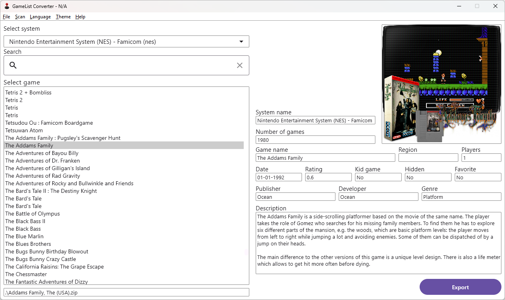
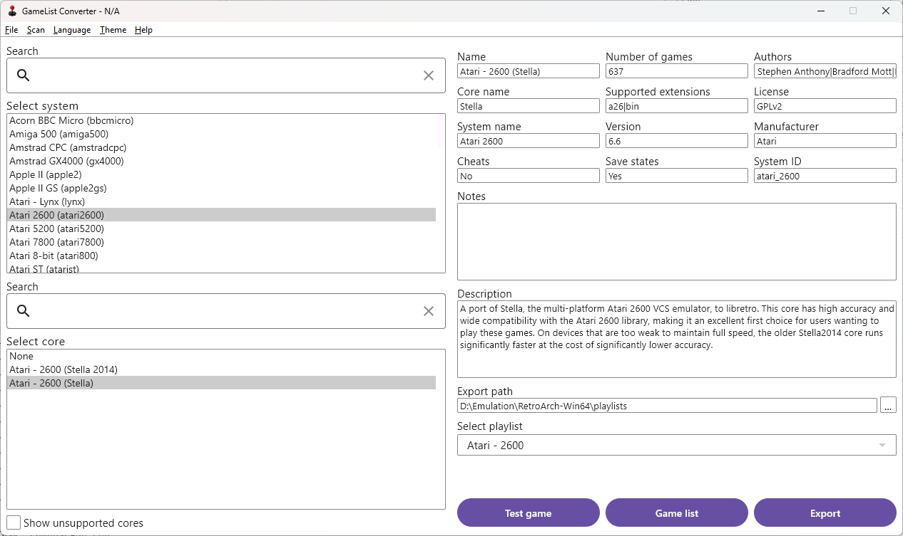

# GameList.xml to RetroArch Playlist Converter

## Table of content
- [Overview](#overview)
- [User Manual](#how-to-use-the-gamelis-converter)
- [Features](#features)
- [Project Structure](#project-structure)
- [Modules](#modules)
  - [UI Module](#ui-module-commonmain)
  - [Game List Provider](#gamelistprovider)
  - [List Exporter](#listexporter)
  - [RetroArch Info Loader](#retroarchinfoloader)
- [Tech Stack](#tech-stack)
- [Getting Started](#getting-started)
- [Contributing](#contributing)
- [License](#license)
- [Contact](#contact)

## Overview
This project is a Kotlin Multiplatform (KMP) application that converts a `gamelist.xml` file to the [RetroArch](https://www.retroarch.com/) playlist format. 

It follows the principles of clean architecture to ensure modularity, maintainability and testability of the code (even though not a single test is written yet :D).

As you can probably see, it is highly inspired by super awesome [GameList Editor](https://github.com/andresdelcampo/GameList_Editor). This project **is not intended** to replace it. This application **cannot** edit, scrape or manage your `gamelist.xml` in any way. It is only used to convert it to the RetroArch playlist.

For the best results, your `gamelist.xml` should have been created using [Screen Scrapper](https://www.screenscraper.fr/).

## How to use the GameLis Converter?
Detailed instruction can be found in our [User Manual](https://github.com/bnovakovic/gamelistmanager/blob/main/Documentation/UserManual/UserManual.adoc)

## Features
- Parses the `gamelist.xml` file to extract game information which is then displayed at the main screen.
- Generates a RetroArch playlist based on the parsed game data and selected core.
- Supports desktop cross-platform development Windows, Linux and MacOs using Kotlin Multiplatform.

## Project Structure
The project follows the clean architecture pattern, consisting of the following modules:
- **Data**: Contains the repository interfaces and data models.
- **Domain**: Contains the business logic and use cases.
- **Presentation**: Contains the user interface and platform-specific code.

## Modules
The project is divided into the following modules:

### UI Module (commonMain)
The UI module contains the user interface components for the application and is used as the presentation layer.

### GameListProvider
The GameListProvider module is responsible for loading the list of objects from the `gamelist.xml` file that contain information about the games and the system that runs them. It handles the parsing and extraction of game information from the XML file.

### ListExporter
The ListExporter module is used to export the selected `gamelist.xml` to the RetroArch playlist format. It provides functionality to generate the playlist based on the parsed game data and configuration. List is then stored in the appropriate RetroArch format.

### RetroArchInfoLoader
The RetroArchInfoLoader module is responsible for loading the RetroArch cores information from the RetroArch directory. It provides access to core information needed for the playlist conversion process.

## Tech Stack
- **[Kotlin Multiplatform](https://kotlinlang.org/docs/multiplatform.html)**: Enables code sharing between different platforms.
- **[Coroutines](https://kotlinlang.org/docs/coroutines-overview.html)**: Used for asynchronous programming and concurrency.
- **[Compose UI](https://developer.android.com/jetpack/androidx/releases/compose-ui)**: A modern UI toolkit for building native UIs across all platforms, including Android, iOS, and desktop, using a single codebase. Compose UI simplifies and accelerates UI development with its declarative approach and powerful features.
- **[Jackson XML Converter](https://github.com/FasterXML/jackson-dataformat-xml)**: Utilized for parsing and serializing XML data using the Jackson library, allowing seamless conversion between XML and Java/Kotlin objects. Currently default option.
- **[XML.toJSONObject Conversion](https://www.json.org/)**: Utilizes the `XML.toJSONObject` function to convert XML data to a JSON object, providing a convenient way to work with XML data and integrate it with JSON-based processing and tools. Then JSON object is converted to the appropriate Kotlin data class. Since this method uses two conversions, I decided to go for Jackson implementation. But in case you don't like it, just change the converter in AppViewModel and you should be good to go. No additional work is needed since every peace of code is already working.
- **[ViewModel](https://developer.android.com/topic/libraries/architecture/viewmodel)**: The ViewModel component, used for managing UI-related data in a lifecycle-conscious way. In this project, ViewModel is utilized specifically for desktop development, allowing data to survive configuration changes and aiding in separating the UI logic from the UI controller.

## Getting Started
To build and run the project, follow these steps:
1. Clone the repository.
2. Open the project in Android Studio or your preferred IDE.
3. Build the project and run the application on your desired platform using green play button in your IDE. If that does not work, you can use `./gradlew run` gradle task to to run the project, or use gradle task list `Tasks->compose desktop->run`.

## Contributing
If you would like to contribute to the project, either create the pull request, or contact me in the issues section. If you decide to create pull request, please make sure to follow S.O.L.I.D. and Clean Architecture principles.
**Contact** me before spending a lots of time on big PR's just to make sure we are on the same page for the big new feature. 

## License
This project is licensed under the [Apache-2.0 license](LICENSE).

## Contact
For any questions or support, please contact me using issues in this repository.